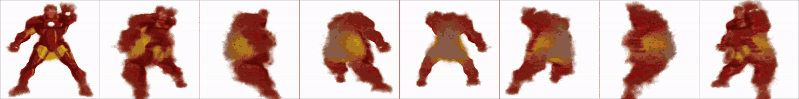
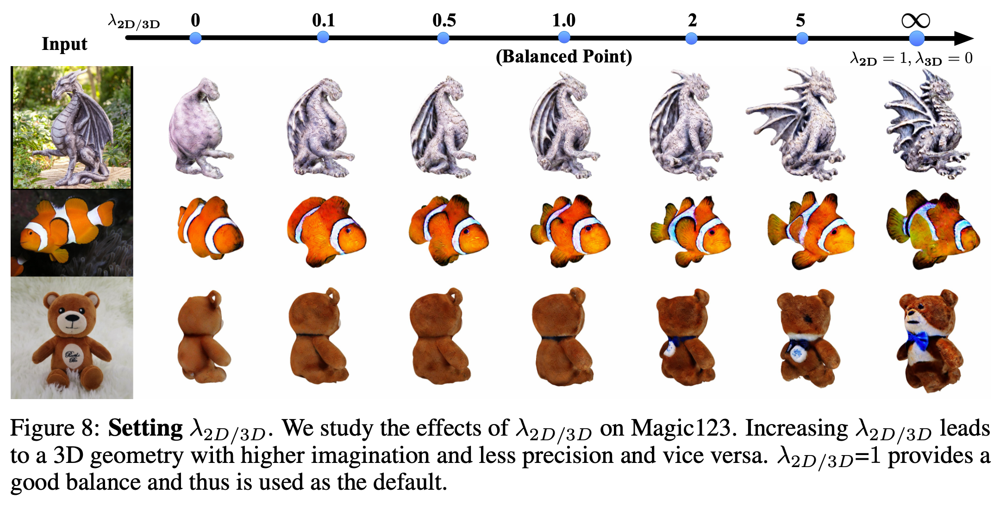

# Magic123: One Image to High-Quality 3D Object Generation Using Both 2D and 3D Diffusion Priors

[arXiv](https://arxiv.org/abs/2306.17843) | [webpage](https://guochengqian.github.io/project/magic123/)


[Guocheng Qian](https://guochengqian.github.io/) <sup>1,2</sup>, [Jinjie Mai](https://cemse.kaust.edu.sa/people/person/jinjie-mai) <sup>1</sup>, [Abdullah Hamdi](https://abdullahamdi.com/) <sup>3</sup>, [Jian Ren](https://alanspike.github.io/) <sup>2</sup>, [Aliaksandr Siarohin](https://aliaksandrsiarohin.github.io/aliaksandr-siarohin-website/) <sup>2</sup>, [Bing Li](https://cemse.kaust.edu.sa/people/person/bing-li) <sup>1</sup>, [Hsin-Ying Lee](http://hsinyinglee.com/) <sup>2</sup>, [Ivan Skorokhodov](https://universome.github.io/) <sup>1,2</sup>, [Peter Wonka](https://peterwonka.net/) <sup>1</sup>, [Sergey Tulyakov](http://www.stulyakov.com/) <sup>2</sup>, [Bernard Ghanem](https://www.bernardghanem.com/) <sup>1</sup>

<sup>1</sup> [King Abdullah University of Science and Technology (KAUST)](https://www.kaust.edu.sa/),
<sup>2</sup> [Snap Inc.](https://www.snap.com/),
<sup>3</sup> [Visual Geometry Group, University of Oxford](http://www.robots.ox.ac.uk/~vgg/)


Training convergence of a demo example:



Compare Magic123 without textual inversion with abaltions using only 2D prior (SDS) or using only 3D prior (Zero123):

https://github.com/guochengqian/Magic123/assets/48788073/e5a3c3cb-bcb1-4b10-8bfb-2c2eb79a9289


Effects of Joint Prior. Increasing the strength of 2D prior leads to more imagination, more details, and less 3D consistencies. 



Official PyTorch Implementation of Magic123: One Image to High-Quality 3D Object Generation Using Both 2D and 3D Diffusion Priors. Code is built upon [Stable-DreamFusion](https://github.com/ashawkey/stable-dreamfusion) repo.


# NEWS:
- [2023/07/25] Code is available at [GitHub](https://github.com/guochengqian/Magic123) 
- [2023/07/03] Paper is available at [arXiv](https://arxiv.org/abs/2306.17843) 
- [2023/06/25] Much better performance than the submitted version is achieved by 1）reimplementing Magic123 using [Stable DreamFusion code](https://github.com/ashawkey/stable-dreamfusion), 2）fixing some gradient issues, 3）leveraging the [tricks](#tips-and-tricks)
- [2023] Initial version of Magic123 submitted to conference


# Install

### Install Environment 

```bash
source install.sh
```

### Download pre-trained models

* [Zero-1-to-3](https://github.com/cvlab-columbia/zero123) for 3D diffusion prior.
    We use `105000.ckpt` by default, reimplementation borrowed from Stable Diffusion repo, and is available in `guidance/zero123_utils.py`.
    ```bash
    cd pretrained/zero123
    wget https://huggingface.co/cvlab/zero123-weights/resolve/main/105000.ckpt
    cd .../../
    ```

* [MiDaS](https://github.com/isl-org/MiDaS) for depth estimation.
    We use `dpt_beit_large_512.pt`. Put it in folder `pretrained/midas/`
    ```bash
    mkdir -p pretrained/midas
    cd pretrained/midas
    wget https://github.com/isl-org/MiDaS/releases/download/v3_1/dpt_beit_large_512.pt
    cd ../../
    ```

# Usage
## Preprocess [Optional]
We have included all preprocessed files in `./data` directory. Preprocessing is only necessary if you want to test on your own examples. 

### Step1: Extract depth 
```
python preprocess_image.py --path /path/to/image 
```


### Step 2: Textural inversion [Optional]
Magic123 uses the defualt [textural inversion](https://huggingface.co/docs/diffusers/training/text_inversion) from diffuers, which consumes around 2.5 hours on a 32G V100. If you do not want to spend time in this textural inversion, you can: (1) study whether there is other faster textural inversion; or (2) do not use textural inversion in the loss of texture and shape consistencies.  To run textural inversion: 

```
bash scripts/texural_inversion/textural_inversion.sh $GPU_IDX runwayml/stable-diffusion-v1-5 /path/to/example/rgba.png /path/to/save $token_name $init_token --max_train_steps 5000
```
$token_name is a the special token, usually name that by _examplename_
$init_token is a single token to describe the image using natural language

For example:
```bash
bash scripts/texural_inversion/textural_inversion.sh runwayml/stable-diffusion-v1-5 data/demo/ironman/rgba.png out/textual_inversion/ironman _ironman_ ironman --max_train_steps 3000
```
Don't forget to move the final `learned_embeds.bin` under data/demo/ironman/


## Run 
### Run Magic123 for a single example
Takes ~40 mins for the coarse stage and ~20 mins for the second stage on a 32G V100. 
```bash
bash scripts/magic123/run_both_priors.sh $GPU_NO $JOBNAME_First_Stage $JOBNAME_Second_Stage $PATH_to_Example_Directory $IMAGE_BASE_NAME $Enable_First_Stage $Enable_Second_Stage {More_Arugments}
```

As an example, run Magic123 in the dragon example using both stages in GPU 0 and set the jobname for the first stage as `default` and the jobname for the second stage as `dmtet`, by the following command:
```bash
bash scripts/magic123/run_both_priors.sh 0 default dmtet data/realfusion15/metal_dragon_statue rgba.png 1 1 
```

More arguments (e.g. `--lambda_guidance 1 40`) can be appended to the command line such as:
```bash
bash scripts/magic123/run_both_priors.sh 0 default dmtet data/realfusion15/metal_dragon_statue rgba.png 1 1 --lambda_guidance 1 40
```

### Run Magic123 for a group of examples
- Run all examples in a folder, check the scripts `scripts/magic123/run_folder_both_priors.sh`  
- Run all examples in a given list, check the scripts `scripts/magic123/run_list_both_priors.sh` 


### Run Magic123 on a single example without textural inversion
Textural inversion is tedious (requires ~2.5 hours optimization), if you want to test Magic123 quickly on your own example without texural inversion (might degrade the performance), try the following:

- first, foreground and depth estimation
    ```
    python preprocess_image.py --path data/demo/ironman/ironman.png
    ```

- Run Magic123 coarse stage without textural inversion, takes ~40 mins
    ```
    export RUN_ID='default-a-full-body-ironman'
    export DATA_DIR='data/demo/ironman'
    export IMAGE_NAME='rgba.png'
    export FILENAME=$(basename $DATA_DIR)
    export dataset=$(basename $(dirname $DATA_DIR))
    CUDA_VISIBLE_DEVICES=0 python main.py -O \
    --text "A high-resolution DSLR image of a full body ironman" \
    --sd_version 1.5 \
    --image ${DATA_DIR}/${IMAGE_NAME} \
    --workspace out/magic123-${RUN_ID}-coarse/$dataset/magic123_${FILENAME}_${RUN_ID}_coarse \
    --optim adam \
    --iters 5000 \
    --guidance SD zero123 \
    --lambda_guidance 1.0 40 \
    --guidance_scale 100 5 \
    --latent_iter_ratio 0 \
    --normal_iter_ratio 0.2 \
    --t_range 0.2 0.6 \
    --bg_radius -1 \
    --save_mesh
    ```

- Run Magic123 fine stage without textural inversion, takes around ~20 mins 
    ```
    export RUN_ID='default-a-full-body-ironman'
    export RUN_ID2='dmtet'
    export DATA_DIR='data/demo/ironman'
    export IMAGE_NAME='rgba.png'
    export FILENAME=$(basename $DATA_DIR)
    export dataset=$(basename $(dirname $DATA_DIR))
    CUDA_VISIBLE_DEVICES=0 python main.py -O \
    --text "A high-resolution DSLR image of a full body ironman" \
    --sd_version 1.5 \
    --image ${DATA_DIR}/${IMAGE_NAME} \
    --workspace out/magic123-${RUN_ID}-${RUN_ID2}/$dataset/magic123_${FILENAME}_${RUN_ID}_${RUN_ID2} \
    --dmtet --init_ckpt out/magic123-${RUN_ID}-coarse/$dataset/magic123_${FILENAME}_${RUN_ID}_coarse/checkpoints/magic123_${FILENAME}_${RUN_ID}_coarse.pth \
    --iters 5000 \
    --optim adam \
    --known_view_interval 4 \
    --latent_iter_ratio 0 \
    --guidance SD zero123 \
    --lambda_guidance 1e-3 0.01 \
    --guidance_scale 100 5 \
    --rm_edge \
    --bg_radius -1 \
    --save_mesh 
    ```

### Run ablation studies
- Run Magic123 with only 2D prior *with* textural inversion (Like RealFusion but we achieve much better performance through training stragies and the coarse-to-fine pipeline)
    ```
    bash scripts/magic123/run_2dprior.sh 0 default dmtet data/realfusion15/metal_dragon_statue rgba.png 1 1
    ```

- Run Magic123 with only 2D prior *without* textural inversion (Like RealFusion but we achieve much better performance through training stragies and the coarse-to-fine pipeline)
    ```
    bash scripts/magic123/run_2dprior_notextinv_ironman.sh 0 default 1 1
    ```
    note: change the path and the text prompt inside the script if you wana test another example. 

- Run Magic123 with only 3D prior (Like Zero-1-to-3 but we achieve much better performance through training stragies and the coarse-to-fine pipeline)
    ```
    bash scripts/magic123/run_3dprior.sh 0 default dmtet data/demo/ironman rgba.png 1 1
    ```


# Tips and Tricks
1. Fix camera distance (*radius_range*) and FOV (*fovy_range*) and tune the camera polar range (*theta_range*). Note it is better to keep camera jittering to reduce grid artifacts. 
2. Smaller range of time steps for the defusion noise (t_range). We find *[0.2, 0.6]* gives better performance for image-to-3D tasks. 
3. Using normals as latent in the first 2000 improves generated geometry a bit gernerally (but not always). We turn on this for Magic123 corase stage in the script `--normal_iter_ratio 0.2` 
4. We erode segmentation edges (makes the segmentation map 2 pixels shrinked towards internal side) to remove artifacts due to segmentation erros. This is turned on in the fine stage in magic123 in the script through `--rm_edge`
5. Other general tricks such as improved texural inversion, advanced diffusion prior (DeepFloyd, SD-XL), stronger 3D prior (Zero123-XL), and larger batch size can be adopted as well but not studied in this work.
6. textural inversion is not very necessary for well-known things (e.g. ironman) and easily described textures and geoemtries, since pure texts contains these texture information and will be understood by diffusion models. We use textural inversion by default in all experiments.

# Acknowledgement
This work is build upon Stable DreamFusion, many thanks to the author [Kiui Jiaxiang Tang](https://github.com/ashawkey) and many other contributors. 

* [Stable DreamFusion](https://github.com/ashawkey/stable-dreamfusion)

```
@misc{stable-dreamfusion,
    Author = {Jiaxiang Tang},
    Year = {2022},
    Note = {https://github.com/ashawkey/stable-dreamfusion},
    Title = {Stable-dreamfusion: Text-to-3D with Stable-diffusion}
}
```


We also get inspirations from a list of amazing research works and open-source projects, thanks a lot to all the authors for sharing!

* [DreamFusion: Text-to-3D using 2D Diffusion](https://dreamfusion3d.github.io/)
    ```
    @article{poole2022dreamfusion,
        author = {Poole, Ben and Jain, Ajay and Barron, Jonathan T. and Mildenhall, Ben},
        title = {DreamFusion: Text-to-3D using 2D Diffusion},
        journal = {arXiv},
        year = {2022},
    }
    ```

* [Magic3D: High-Resolution Text-to-3D Content Creation](https://research.nvidia.com/labs/dir/magic3d/)
   ```
   @inproceedings{lin2023magic3d,
      title={Magic3D: High-Resolution Text-to-3D Content Creation},
      author={Lin, Chen-Hsuan and Gao, Jun and Tang, Luming and Takikawa, Towaki and Zeng, Xiaohui and Huang, Xun and Kreis, Karsten and Fidler, Sanja and Liu, Ming-Yu and Lin, Tsung-Yi},
      booktitle={IEEE Conference on Computer Vision and Pattern Recognition ({CVPR})},
      year={2023}
    }
   ```

* [Zero-1-to-3: Zero-shot One Image to 3D Object](https://github.com/cvlab-columbia/zero123)
    ```
    @misc{liu2023zero1to3,
        title={Zero-1-to-3: Zero-shot One Image to 3D Object},
        author={Ruoshi Liu and Rundi Wu and Basile Van Hoorick and Pavel Tokmakov and Sergey Zakharov and Carl Vondrick},
        year={2023},
        eprint={2303.11328},
        archivePrefix={arXiv},
        primaryClass={cs.CV}
    }
    ```

* [RealFusion: 360° Reconstruction of Any Object from a Single Image](https://github.com/lukemelas/realfusion)
    ```
    @inproceedings{melaskyriazi2023realfusion,
        author = {Melas-Kyriazi, Luke and Rupprecht, Christian and Laina, Iro and Vedaldi, Andrea},
        title = {RealFusion: 360 Reconstruction of Any Object from a Single Image},
        booktitle={CVPR}
        year = {2023},
        url = {https://arxiv.org/abs/2302.10663},
    }
    ```

* [Make-it-3d: High-fidelity 3d creation from a single image with diffusion prior](https://arxiv.org/abs/2303.14184)
    ```
    @article{tang2023make-it-3d,
        title={Make-it-3d: High-fidelity 3d creation from a single image with diffusion prior},
        author={Tang, Junshu and Wang, Tengfei and Zhang, Bo and Zhang, Ting and Yi, Ran and Ma, Lizhuang and Chen, Dong},
        journal={arXiv preprint arXiv:2303.14184},
        year={2023}
    }
    ```

* [Stable Diffusion](https://github.com/CompVis/stable-diffusion) and the [diffusers](https://github.com/huggingface/diffusers) library.

    ```
    @misc{rombach2021highresolution,
        title={High-Resolution Image Synthesis with Latent Diffusion Models},
        author={Robin Rombach and Andreas Blattmann and Dominik Lorenz and Patrick Esser and Björn Ommer},
        year={2021},
        eprint={2112.10752},
        archivePrefix={arXiv},
        primaryClass={cs.CV}
    }

    @misc{von-platen-etal-2022-diffusers,
        author = {Patrick von Platen and Suraj Patil and Anton Lozhkov and Pedro Cuenca and Nathan Lambert and Kashif Rasul and Mishig Davaadorj and Thomas Wolf},
        title = {Diffusers: State-of-the-art diffusion models},
        year = {2022},
        publisher = {GitHub},
        journal = {GitHub repository},
        howpublished = {\url{https://github.com/huggingface/diffusers}}
    }
    ```


# Cite
If you find this work useful, a citation will be appreciated via:
```
@article{qian2023magic123,
  title={Magic123: One Image to High-Quality 3D Object Generation Using Both 2D and 3D Diffusion Priors},
  author={Qian, Guocheng and Mai, Jinjie and Hamdi, Abdullah and Ren, Jian and Siarohin, Aliaksandr and Li, Bing and Lee, Hsin-Ying and Skorokhodov, Ivan and Wonka, Peter and Tulyakov, Sergey and others},
  journal={arXiv preprint arXiv:2306.17843},
  year={2023}
}
```

